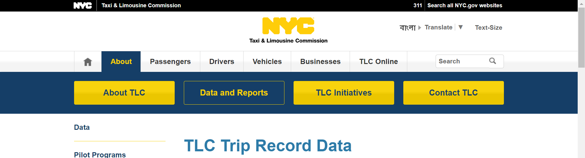
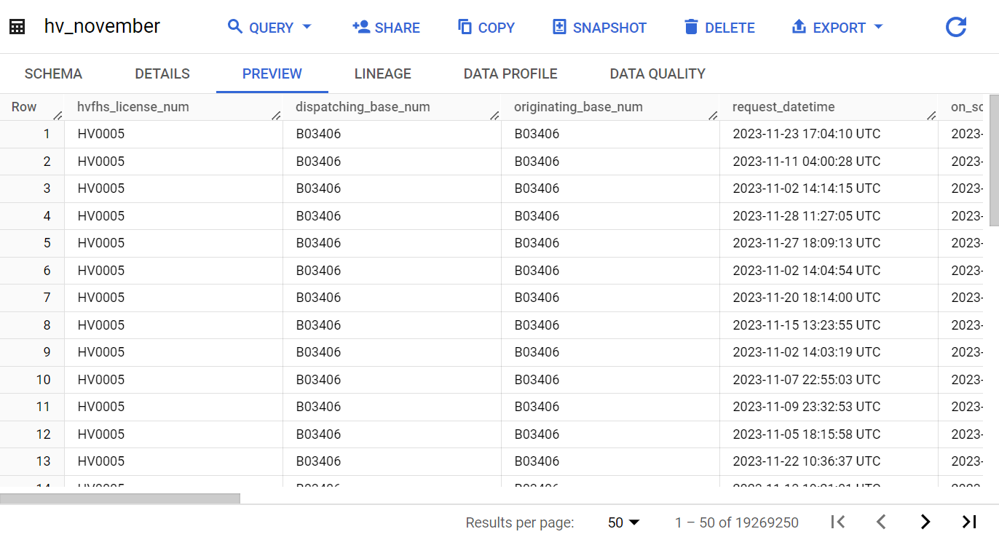
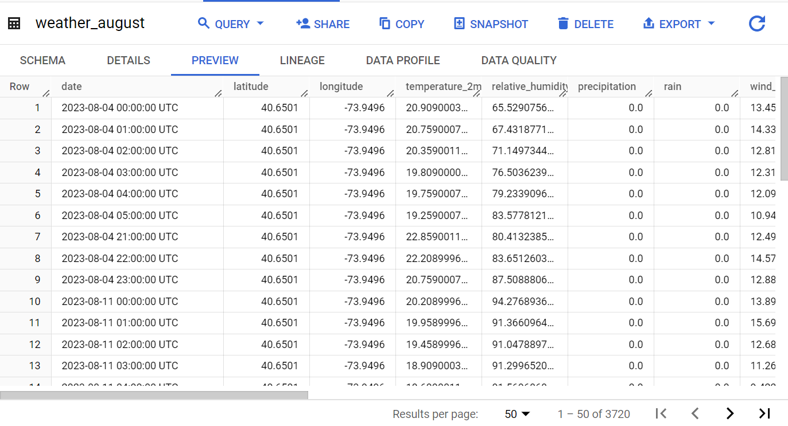
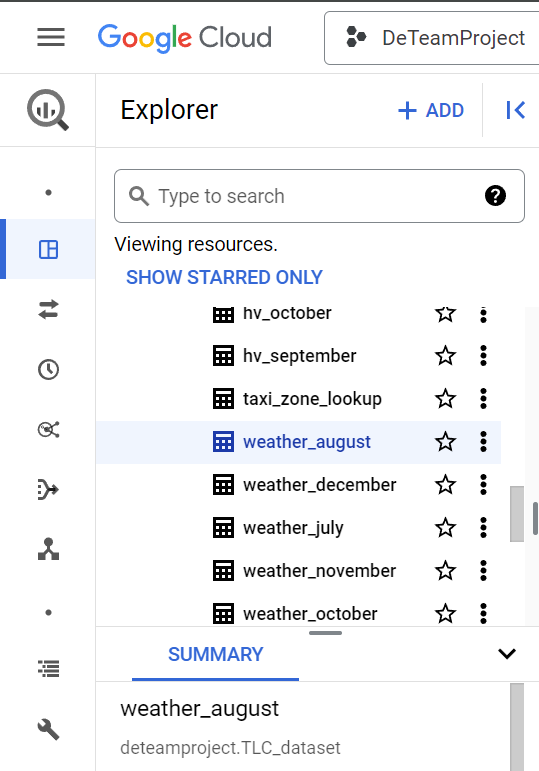

**Business Problem**
---------------------- 
The Taxi and Limousine Commission (TLC) is in charge of the licensing and regulationg of NYC's taxi cabs, for hire vehicles, and paratransit vehicles. We want to know if the weather (precipitation, the wind speed for 10 and 100 meters, and temperature) had an impact on the distant trip. Similarly we are looking for the correlation between the trips and the temperature, and the dissent trip. We are also looking for the TLC and High Volume trips from July until December. We want to keep track of the location and borough of each trip and if it has an added $15 due to being below the 60th line in Manhattan. High Volume, HV, are trips taken outside of the scope of TLC such as Ubers and Lyft.

**Business Impact**
---------------------- 
The business will be very positive because it will allow TLC to adjust how they operate to compete with those High Volume vehicles mentioned before. By understanding the various variables associtated with a taxi trip, TLC can see which base generates the most, how many vehicles to put out based on weather/ location, and so much more. Of course there is the risk of the correlation not being the causation and therefore disrupting the operations that was standing before hand, which would also cost TLC. 

**Business Persona** 
---------------------- 
The people who are going to be the actors of the system are those who take taxis or those high volume ride sharing apps, since without them we would have no data. On the other hand the managers and other high level decision makers are who this system is made for so they can see the impact, correlation, and opportunity. 

 
**Data**
----------------------
We have many sources of data primarly coming from TLC's api. From TLC we took Yellow taxi, Green taxi, High Volume, and For Hire tables for the months of July to December 2023. Big picture the data captured were ranged from boroughs, Pick up location, wether or not the zone was below 60th st or not, and more granular pieces of data. The downside of the data is that there different names for same columns for yellow/green taxi and high volume taxi which make it difficult to run queries.However, due to the amount of data being granular, it was easy to get the data needed. We also dealt with weather data from Open-Meteo which consisted of longitude, latitude, precipation, and more weather related data for the given year in the location of our focus, New York City. This dataset was very large; follwing the same tone as the datasets mention above, the amount of data being granular, it was easy to get the data needed. That happened to also be its downside, because it gave data that was more than neccesary. 

**Methods**
----------------------
When we first understood our datasets to be used we used python and jupyter notebooks and via APIs we extracted and played with some of the data. Using the data dictionaries given we were able to clarify what exactly we are dealing with. We then used DbSchema to generate a logical model. Next we had to deal with the extraction of all datasets and uploading them directly to our cloud of choice Google Cloud Storage. In order to procceed we had to create an account and ensure our familiarity with GCS. We interacted with IAM, Big Query and Cloud Storage. Once we uploaded, we used dbt to make the appropriate dimensions and fact table based on our model mentioned earlier. To conclude things we used Power BI for the visualizations.

**Data Tools**
----------------------
Data Storage used was Big Query via GCS and we used python scripts and jupyter notebooks to ingest the data. We discussed the possibilty of using terraform to help automate our data pipeline, but we decided to save that for the future!

**Interface**
----------------------
Feel free to view our Power BI visualization: 